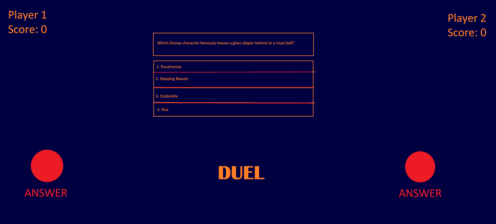

# Harjoitustyön suunnitelma

(Täydennä oman pelisi tiedot tähän tiedostoon muokkaamalla 
tiedostoa tekstieditorissa. Käytä [Markdown-syntaksia](https://about.gitlab.com/handbook/markdown-guide/).
Poista sitten *kaikki* suluilla merkityt kohdat.)

## Tietoja 

Tekijät: Tuulia Hynynen & Laiba Khan

Työ git-varaston osoite: <https://gitlab.jyu.fi/tahehyny/ohj1ht.git>

Pelin nimi: Duel

Pelialusta: Windows

Pelaajien lukumäärä: 2

## Pelin tarina

The Duel offers a modern way to solve conflicts by duel at the modern world where you are not free to use guns and violence. At Duel you'll use your reactivity, brain and knowledge as your weapon. The winner of Duel wins the original conflict and gets a right to call him/herself the boss for next 24 hours. If the boss is a gamblerer he may choose to rematch for win the title of greatmaster. If the boss loses the rematch he'll lose it all and the underdog will rise and be the greatmaster.

## Pelin idea ja tavoitteet

Player who clicks the answer-button quicker gets right to answer the question. For every question there is four alternatives for answer and player must choose the right one. For a right answer the player gets one point. Calculator counts the scores and the winner is player who first reaches to 10 points.

## Hahmotelma pelistä

(Kun olet lisännyt suunnitelmakuvan tähän hakemistoon, linkitä se tähän alle. Alla on esimerkkikuvan linkitys.)

## Toteutuksen suunnitelma

Helmikuu

- Game structure and logics

Maaliskuu

- guestions
- Visual look

Jos aikaa jää

- Increase the amount of questions
- Make player scores decrease by 1 for wrong answer
